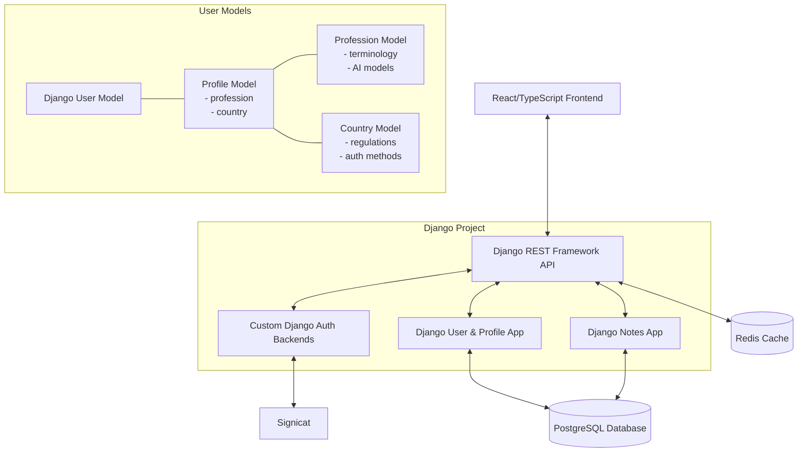
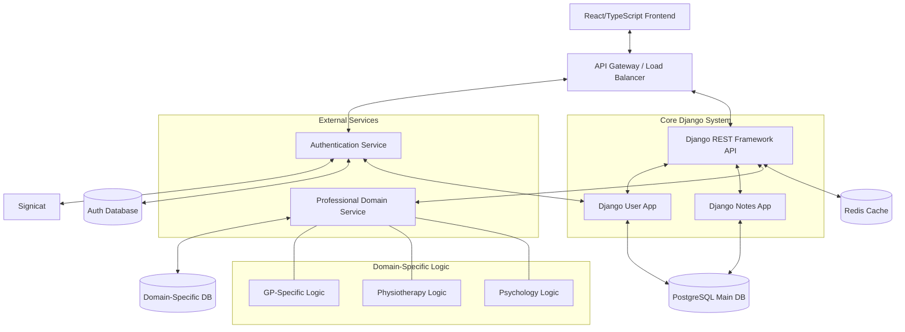
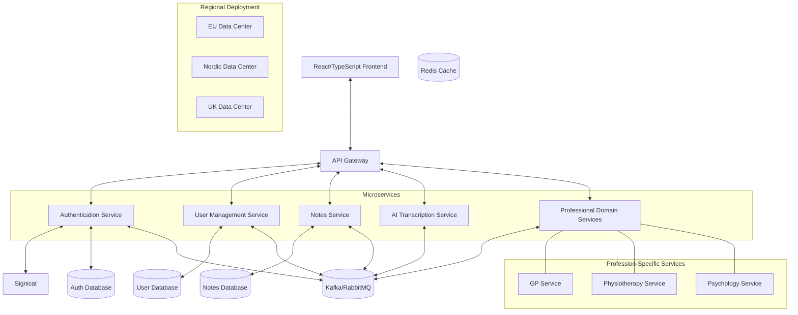
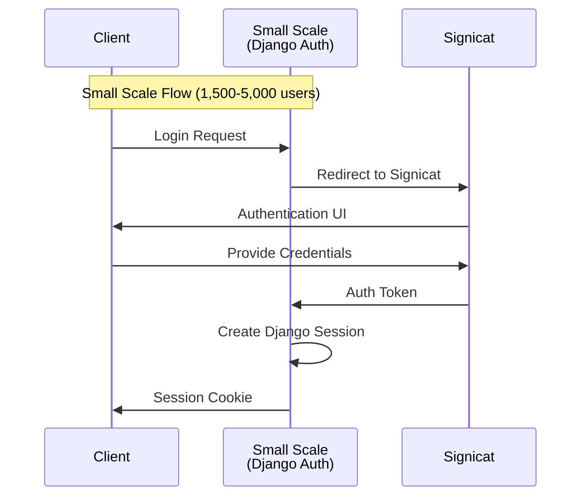
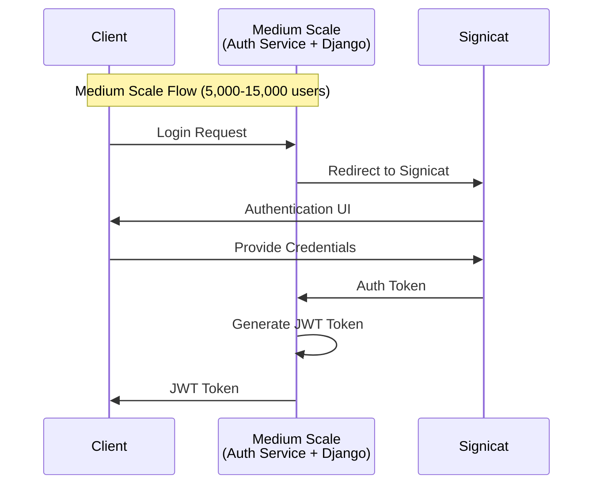
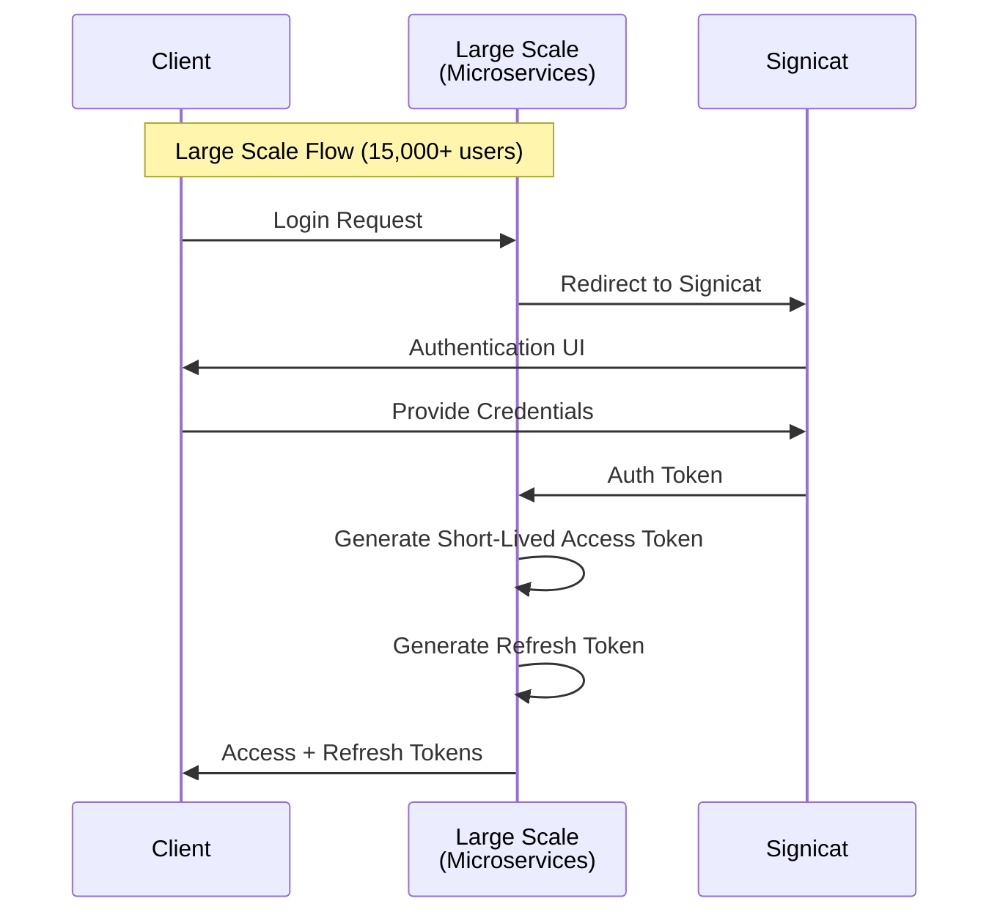
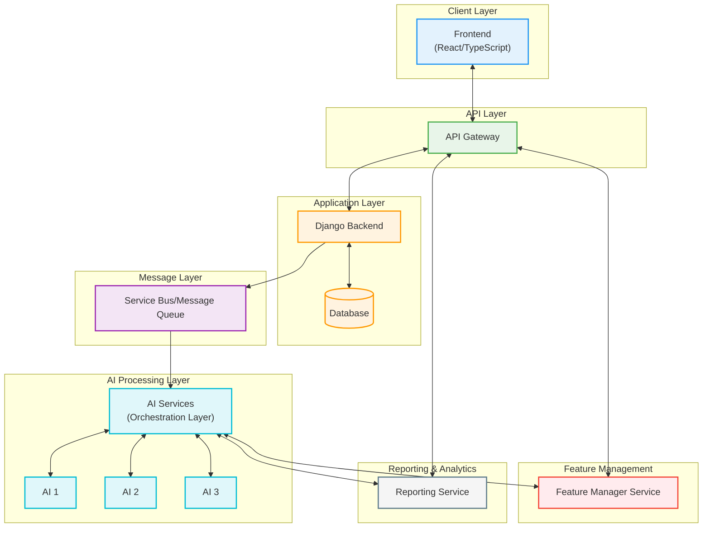
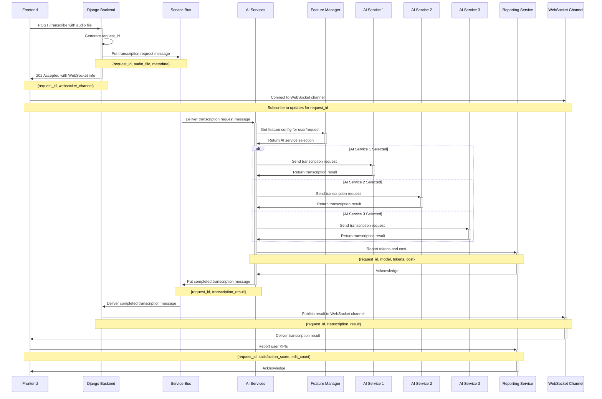
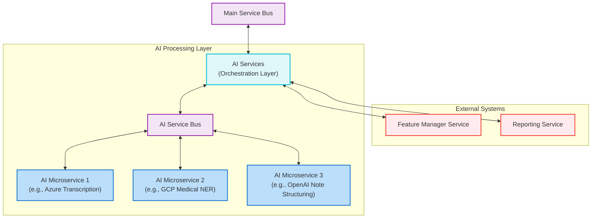
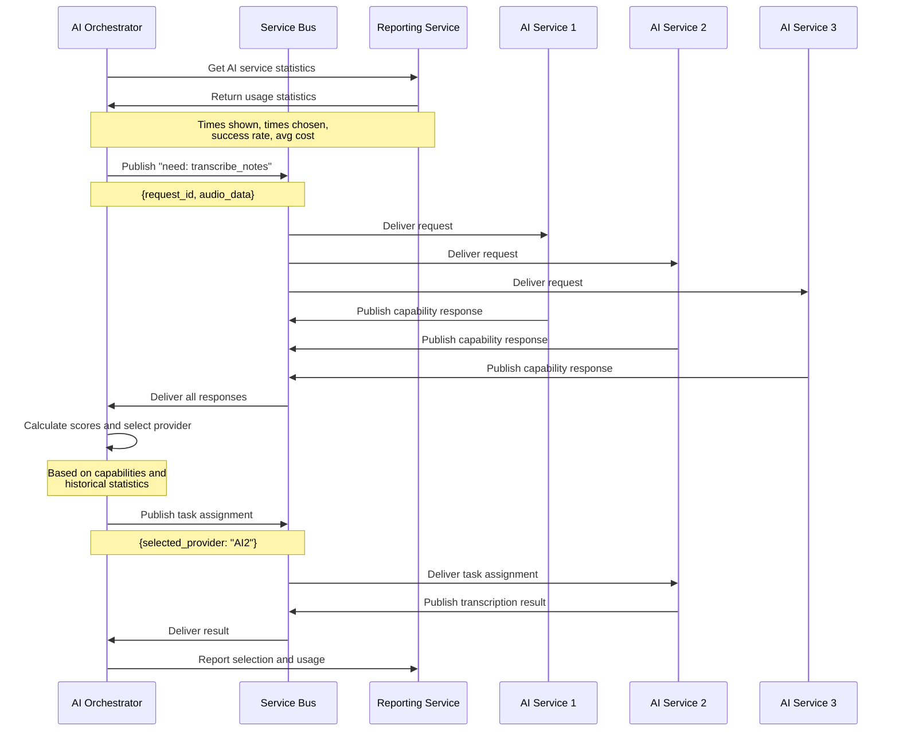

---
# You can also start simply with 'default'
theme: seriph
# random image from a curated Unsplash collection by Anthony
# like them? see https://unsplash.com/collections/94734566/slidev
background: https://cover.sli.dev
# some information about your slides (markdown enabled)
title: Noteless Technical Case
info: |
  ## Noteless Technical Case
  Sindre Sivertsen

# apply unocss classes to the current slide
class: text-center
# https://sli.dev/features/drawing
drawings:
  persist: false
# slide transition: https://sli.dev/guide/animations.html#slide-transitions
transition: slide-left
# enable MDC Syntax: https://sli.dev/features/mdc
mdc: true

---

# Noteless Technical Case

Sindre Sivertsen

  Press Space for next page <carbon:arrow-right />

  <button @click="$slidev.nav.openInEditor" title="Open in Editor" class="slidev-icon-btn">
    <carbon:edit />
  </button>
  <a href="https://github.com/slidevjs/slidev" target="_blank" class="slidev-icon-btn">
    <carbon:logo-github />
  </a>

<!--
The last comment block of each slide will be treated as slide notes. It will be visible and editable in Presenter Mode along with the slide. [Read more in the docs](https://sli.dev/guide/syntax.html#notes)
-->

---
transition: fade-out
---

# Task 1

Scenario:
Noteless is expanding internationally and must support various local authentication systems
(e.g., Norwegian BankID, Danish MitID, Email OTP, and additional local 2FA methods via
Signicat). The platform also needs to manage segmented user profiles for different
professions (e.g, GPs, Physiotherapists, Psychologists) and countries (Norway, Denmark,
Europe).
Objectives:
Design a scalable authentication service that cleanly abstracts multiple methods while
ensuring security, data privacy, and smooth integration with our Django REST Framework
backend. Incorporate local compliance and language-specific flows to support
internationalization and future B2B requirements.
Deliverables:
- A high-level architecture diagram showing how the authentication service interacts
with the React/TypeScript frontend and Django backend, how third-party auth
providers are integrated, and how user segmentation/localization is managed.
- A brief explanation of your design decisions and

---

# Small Scale Architecture (1,500-5,000 users)

<!--
For mindre brukerbaser er en monolitisk Django-applikasjon effektiv og håndterbar:  
**Nøkkelfunksjoner:**

- **Integrated Django Application**: All funksjonalitet er samlet i ett enkelt Django-prosjekt  
- **Custom Authentication Backends**: Djangos autentiseringssystem er utvidet for å støtte Signicat og andre metoder  
- **Flexible Data Models**: Brukerprofiler inkluderer feltene yrke og land for å støtte segmentering  
- **Redis Caching**: Forbedrer ytelsen for ofte etterspurte data  
- **Single Database**: All data lagres i én PostgreSQL-database med korrekt indeksering  

**Fordeler:**

- **Simplicity**: Enklere å utvikle, deploye og vedlikeholde  
- **Developer Productivity**: Djangos admin-grensesnitt og ORM gir rask utvikling  
- **Low Operational Overhead**: Kun én applikasjon å overvåke og skalere  
- **Future-Proofing**: Modellene er designet for å kunne håndtere fremtidig vekst  

**Implementasjonsnotater:**

- Bruk Djangos **custom authentication backends** for å integrere med Signicat  
- Implementer en fleksibel `Profile`-modell med foreign keys til `Profession`- og `Country`-modeller  
- Bruk Django **signals** for å oppdatere relatert data når profiler endres  
- Utnytt Djangos **permission system** for tilgangskontroll basert på yrke
-->

---
transition: fade-out
---

# Medium Scale Architecture (1,500-5,000 users)

<!--
Etter hvert som brukerbasen vokser, begynner en hybrid tilnærming å trekke ut kritiske tjenester:  
**Nøkkelfunksjoner:**

- **API Gateway**: Ruter forespørsler til riktige tjenester  
- **Separate Authentication Service**: Håndterer kompleksiteten med flere autentiseringsmetoder  
- **Core Django Application**: Håndterer fortsatt brukerprofiler og hovedlogikken i applikasjonen  
- **Domain-Specific Service**: Trekker ut yrkesspesifikk logikk i en egen tjeneste  
- **Multiple Databases**: Skiller autentiseringsdata fra hoveddataene i applikasjonen  

**Fordeler:**

- **Improved Scalability**: Autentisering og domenespesifikk logikk kan skaleres uavhengig  
- **Better Separation of Concerns**: Kompleksitet rundt autentisering isoleres fra hovedapplikasjonen  
- **Flexible Growth**: Tjenestene kan utvikles i ulikt tempo  
- **Incremental Migration**: Funksjonalitet kan gradvis flyttes fra Django til separate tjenester  

**Implementasjonsnotater:**

- **Authentication service** utsteder JWT-er som Django validerer  
- **Domain service** håndterer yrkesspesifikke termer og arbeidsflyt  
- Django håndterer fortsatt kjerneprofiler, men koordinerer med eksterne tjenester  
- Databasetilkoblinger er optimalisert for ulike tilgangsmønstre
-->

---
transition: slide-up
level: 2
---

# Large Scale Architecture (15,000+ users)

<!-- 

For storskala operasjoner på tvers av flere land er en full microservice-arkitektur passende:
Nøkkelfunksjoner:

Complete Microservice Architecture: Hver hovedfunksjon er sin egen tjeneste

Dedicated User Management Service: Håndterer alle aspekter av brukerprofiler og segmentering

Message Queue Integration: Tjenester kommuniserer asynkront for bedre robusthet

Regional Deployment: Tjenester kan deployes i ulike regioner for å møte krav til etterlevelse

Profession-Specific Services: Hver medisinsk profesjon har dedikert forretningslogikk

Fordeler:

Maximum Scalability: Hver tjeneste kan skaleres uavhengig basert på behov

Geographic Distribution: Tjenester kan deployes nær brukere i ulike regioner

Enhanced Resilience: Feil i én tjeneste påvirker ikke de andre

Specialized Teams: Ulike team kan fokusere på ulike tjenester

Regulatory Compliance: Krav til datalagring kan møtes med regionale deployeringer

Implementasjonsnotater:

Authentication service utsteder kortlevde access tokens og lengre refresh tokens

User service vedlikeholder fullstendig profilinformasjon inkludert profesjon og land

Domain services implementerer spesialisert logikk for hver medisinsk profesjon

Event-driven architecture muliggjør sanntidsoppdateringer på tvers av tjenester
-->

---
layout: center
---

# Authentication Flow Comparison 1

---
layout: center
---

# Authentication Flow Comparison2

---
layout: center
---
# Authentication Flow Comparison3

<!-- 

The fourth diagram shows how the authentication flow evolves across the different scales:

Small Scale: Simple session-based authentication with cookies
Medium Scale: JWT-based authentication with a separate authentication service
Large Scale: Sophisticated token management with access and refresh tokens

All three approaches support integration with Signicat for national ID authentication, but with increasing levels of sophistication in token handling and session management.

-->

---

# Task 2
Scenario:
Noteless wants to build a modular architecture for AI features to be able to quickly iterate and
implement new models and features. The company currently uses different AI models hosted
on providers like Azure ML and GCP Vertex. The goal is to be able to quickly implement, test,
and roll out new models and features for specific user groups.
Objectives:
Propose a strategy that allows easy addition or swapping of AI models and services. Also,
design the solution to support A/B testing, feature flags, and KPI monitoring (for example,
user feedback and note accuracy).
Deliverables:
- An integration diagram that illustrates how our Django/DRF backend will call the
various AI services, the data flow from raw audio to structured notes, and the control
points for testing and feature management.
- A short explanation describing your approach to balan

---

# AI 

---

# AI flow sequence diagram

---
layout: center

---

# Multi armed bandit Flowchart

---

# Multi armed sequence diagram

